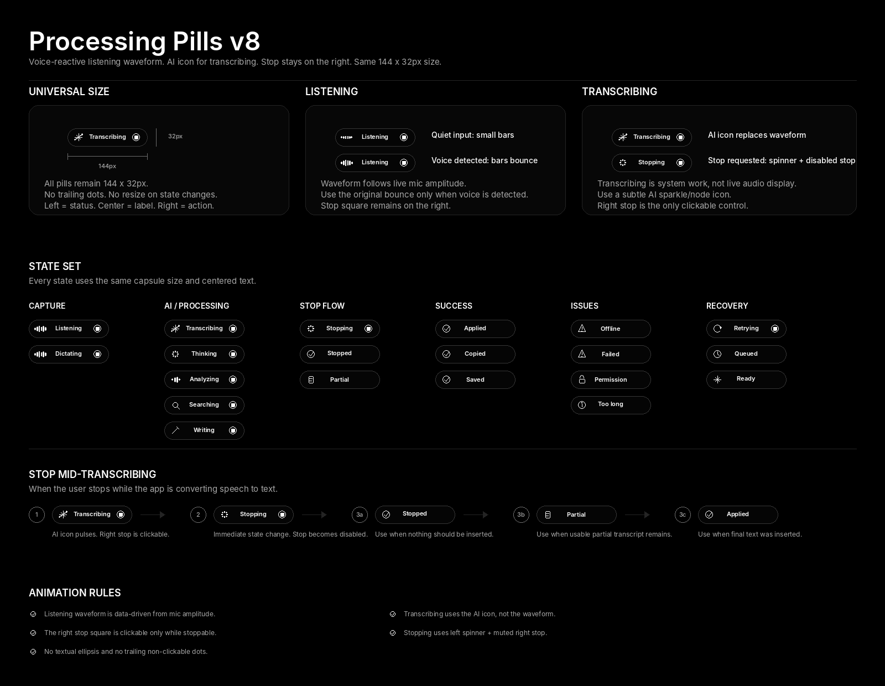

# Processing Pill System V8

## Update summary

This version makes two changes:

1. **Listening** keeps the sound-wave icon, but the wave is now driven by the user's live voice level.
2. **Transcribing** no longer uses the sound-wave icon. It uses a small AI-like sparkle/node icon because the system is converting audio into text.

The stop control remains on the right side whenever stopping is available.

```text
Listening:     [voice waveform] [centered label] [stop]
Transcribing:  [AI icon]        [centered label] [stop]
Stopping:      [spinner]        [centered label] [disabled stop]
```



## Universal size

| Property | Value |
|---|---:|
| Pill width | `144px` |
| Pill height | `32px` |
| Radius | `999px` |
| Left status center | `20px` |
| Label center | `72px` |
| Right action center | `124px` |
| Label safe zone | `34px -> 110px` |
| Icon size | `14px` |
| Font size | `11px` |

All pills keep the same size. No state is allowed to resize the pill.

## Icon mapping

| State | Left icon | Right icon | Motion |
|---|---|---|---|
| `Listening` | Voice waveform | Stop square | Waveform reacts to mic amplitude. |
| `Dictating` | Voice waveform | Stop square | Same as listening. |
| `Transcribing` | AI sparkle/node | Stop square | AI icon subtly pulses. |
| `Thinking` | Spinner | Stop square | Spinner rotates. |
| `Analyzing` | Bars | Stop square | Bars pulse. |
| `Searching` | Search | Stop square | Static or subtle scan. |
| `Writing` | Pen | Stop square | Static or subtle scan. |
| `Stopping` | Spinner | Disabled stop square | Spinner rotates; stop action disabled. |
| `Stopped` | Check | Empty | Check draws once. |
| `Partial` | Document | Empty | Static. |
| `Applied` | Check | Empty | Check draws once. |
| `Issues` | Issue-specific icon | Empty or real action | Static. |

## Listening waveform behavior

The listening waveform should not be a fake decorative loop. It should react to the user's actual voice input.

Recommended behavior:

- When no voice is detected, bars rest near the baseline.
- When voice is detected, bars bounce with the amplitude.
- Use fast attack and slower release so it feels responsive but not jittery.
- The waveform stays inside the left icon slot. The pill does not resize.
- The right stop square remains visible and clickable.

### Voice amplitude algorithm

```ts
const noiseGate = 0.018;
const gain = 3.2;
const attack = 0.42;
const release = 0.14;

function getVoiceLevel(samples: Uint8Array, previousLevel: number) {
  let sum = 0;

  for (const sample of samples) {
    const centered = (sample - 128) / 128;
    sum += centered * centered;
  }

  const rms = Math.sqrt(sum / samples.length);
  const gated = Math.max(0, rms - noiseGate);
  const target = Math.min(1, gated * gain);
  const smoothing = target > previousLevel ? attack : release;

  return previousLevel + (target - previousLevel) * smoothing;
}
```

### Bar mapping

```ts
const barWeights = [0.35, 0.62, 0.92, 0.70, 0.82, 0.48];

function getWaveBars(level: number) {
  return barWeights.map((weight, index) => {
    const stagger = 0.86 + Math.sin(performance.now() / 90 + index) * 0.14;
    return 2 + level * weight * stagger * 12;
  });
}
```

Use these bar heights to update the SVG rect heights or CSS scale values.

## Transcribing icon behavior

The transcribing icon should communicate AI/system work, not live audio capture.

Recommended icon:

```text
small sparkle + two connected nodes
```

Motion:

- Subtle pulse every `1200ms`.
- No waveform bounce.
- No trailing dots.
- No text ellipsis.

The reason: once the app is transcribing, the system is interpreting buffered speech and producing text. The waveform belongs to active listening; the AI icon belongs to processing/transcription.

## Stop mid-transcribing

### 1. Active transcribing

```text
[AI icon] Transcribing [stop]
```

- The AI icon subtly pulses.
- The right stop square is clickable.
- Screen reader: `Transcribing. Stop available.`
- Keyboard shortcut: `Esc`.

### 2. User taps stop

```text
[AI icon] Transcribing [pressed stop]
```

- The right stop icon scales down to `92%` for `80ms`.
- The pill size does not change.
- Do not move the stop icon.

### 3. Stop request accepted

```text
[spinner] Stopping [disabled stop]
```

- Switch immediately, ideally within `100ms`.
- Left icon becomes spinner/progress.
- Right stop stays on the right but becomes muted and disabled.
- Label becomes `Stopping`.

### 4. Result state

Choose the terminal state based on what exists:

| Condition | Pill |
|---|---|
| No usable transcript | `[check] Stopped [empty]` |
| Usable partial transcript exists | `[document] Partial [empty]` |
| Final text was inserted | `[check] Applied [empty]` |
| User explicitly discarded work | `[x] Cancelled [empty]` |

## Stop vs cancel

| Intent | Symbol | Meaning |
|---|---|---|
| Stop | Square-in-circle | End the active process and preserve usable work. |
| Cancel | X-in-circle | Discard current work. |
| Stopping | Spinner + disabled stop | Stop request has been accepted and is resolving. |
| Complete | Check-in-circle | Work finished or was applied. |

## Interaction rules

1. Stop is always on the right when available.
2. Listening uses a voice-reactive waveform on the left.
3. Transcribing uses the AI icon on the left.
4. The label remains vertically and horizontally centered.
5. No trailing dots unless they open a real menu.
6. No textual `...` after labels.
7. If a right-side icon is visible, it must be a real action or disabled because the action is already in progress.
8. All states keep the same `144 x 32px` size.

## Accessibility

| Element | Recommendation |
|---|---|
| Listening pill | `aria-label="Listening. Stop available."` |
| Transcribing pill | `aria-label="Transcribing. Stop available."` |
| Stop button | `aria-label="Stop"` |
| Stopping pill | `aria-label="Stopping"` and disabled stop button hidden from tab order. |
| Waveform | Decorative for screen readers; voice status is in the label. |
| AI icon | Decorative for screen readers; transcription status is in the label. |

Do not announce waveform amplitude changes. The animation is visual feedback only.
