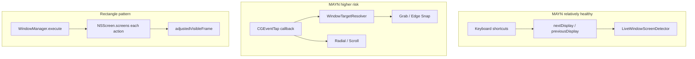

# Rectangle vs MAYN Window Layout — Full Comparison & Bug Registry

Last updated: 2026-06-16

This document compares [Rectangle](https://rectangleapp.com/) (reference: `reference-projects/window_management/Rectangle-main/`) with Mac All You Need Window Layouts / Window Grab / Radial puck. It catalogs known bugs, parity gaps, and a phased fix roadmap.

## Executive summary

- **Monitor hot-plug issues** are a subset of MAYN bugs. Root causes included stale `visibleFrames` in `WindowTargetResolver` and single-screen Y-flip in `ActiveWindowBorderController` (fixed in Phase A).
- **Keyboard next/prev / repeat-half** paths are relatively healthy (`LiveWindowScreenDetector` + 25ms cross-display retry), aligned with Rectangle geometry ordering.
- **MAYN-only paths** (Grab, Radial, scroll resize) concentrated Critical/High issues: synchronous AX in the event tap, rules not wired through all surfaces, split restore identity between keyboard and gesture paths.
- **Rectangle is not perfect** either: no Space API (free tier), Notification Center freezes, Stage heuristics, cross-display AX may need multiple writes, Mission Control guard side effects.

## 1. Architecture comparison

| Dimension | Rectangle | MAYN |
|-----------|-----------|------|
| Screen reads | `NSScreen.screens` every action | Live reads in mover/resolver (post Phase A) |
| Workspace | `adjustedVisibleFrame` (Stage/Todo/gap/notch) | Raw `visibleFrame`; `WindowWorkspaceAdjuster` foundation for gaps |
| Coordinates | AppKit + global `screenFlipped` | CG display + per-screen AppKit conversion |
| Window hit | AX front + cursor fallback | CGWindowList + per-PID AX match |
| Cross-display retry | 2× sync + 25ms async | Same + `clampOffscreenWindow` |
| Space moves | Paid / not in free | `WindowSpaceMover` private API |
| Unique UI | — | Radial puck, Grab anywhere, Snap assist |

## 2. Bug / gap registry

Severity: **C** Critical · **H** High · **M** Medium · **L** Low

### 2.1 Multi-monitor / hot-plug

| ID | Sev | Issue | Status |
|----|-----|-------|--------|
| MON-01 | C | Stale `visibleFrames` after hot-plug | **Fixed** — live read per resolve |
| MON-02 | C | Active border Y-flip used `screens.first` | **Fixed** — per-screen conversion |
| MON-03 | H | `refreshDisplayLayout` did not refresh resolver | **Fixed** — live frames make resolver stateless |
| MON-04 | H | Snap overlay live vs resolver stale mismatch | **Fixed** with MON-01 |
| MON-05 | M | No `screensOrderedByX` setting | Open |
| MON-06 | M | 3+ display ring next/prev not physically adjacent | Shared limitation |
| MON-07 | M | Off-screen legacy flip fallback | Partial |
| MON-08 | L | Hot-plug ends radial session | By design |

### 2.2 Coordinates / overlay

| ID | Sev | Issue | Status |
|----|-----|-------|--------|
| COORD-01 | C | See MON-02 | **Fixed** |
| COORD-02 | H | See MON-04 | **Fixed** |
| COORD-03 | M | Stale event location on some radial triggers | Partial |

### 2.3 AX write reliability

| ID | Sev | Issue | Status |
|----|-----|-------|--------|
| AX-01 | H | Animated moves reported `.moved` before completion | **Fixed** — completion callback |
| AX-02 | M | Electron/Chrome may need extra retry | Partial |
| AX-03 | M | Fixed-size windows failed instead of centering | **Fixed** — center in target region |
| AX-04 | M | Double-click maximize 10px tolerance | Open |
| AX-05 | L | Three AX writes ignore per-call return | By design |

### 2.4 Edge snap / Window Grab

| ID | Sev | Issue | Status |
|----|-----|-------|--------|
| SNAP-01 | C | Sync AX in event tap | **Mitigated** — event-tap resolve options + per-PID AX |
| SNAP-02 | H | `windowRules` not applied on gesture path | **Fixed** |
| SNAP-03 | H | `targetIsNormalNonMAYNWindow` hardcoded | **Fixed** — validates target |
| SNAP-04 | H | Own bundle not filtered | **Fixed** |
| SNAP-05 | M | Edge snap only when Layouts enabled | Product split |
| SNAP-06 | M | Title bar snap region fixed 56pt | **Fixed** — respects `titleBarYOffset` |
| SNAP-07 | L | Mission Control clamp top edge only | Partial |

### 2.5 Radial puck

| ID | Sev | Issue | Status |
|----|-----|-------|--------|
| RAD-01 | H | Cached target across session | **Fixed** — refresh on update |
| RAD-02 | H | Requires Layouts runtime | Open |
| RAD-03–05 | M/L | Preview parity, click capture, missing actions | Open |

### 2.6 Keyboard / hotkeys

| ID | Sev | Issue | Status |
|----|-----|-------|--------|
| HK-01 | H | GlobalHotkey + event tap dual registration | Open |
| HK-02–04 | M/L | Async ordering, enabled flag, default shortcuts | Partial |

### 2.7 Restore history

| ID | Sev | Issue | Status |
|----|-----|-------|--------|
| RST-01 | H | Keyboard path lacked `cgWindowID` | **Fixed** |
| RST-02 | H | Split identity keyboard vs gesture | **Fixed** |
| RST-03 | M | In-memory only | Open |
| RST-04 | M | Silent no-op when key nil | Open |

### 2.8 Space switching

| ID | Sev | Issue | Status |
|----|-----|-------|--------|
| SPC-01 | H | No user feedback on failure | **Fixed** — HUD toast |
| SPC-02–04 | M/L | Private API risk, separate-spaces UX, no restore | Partial |

### 2.9 Sequoia / system tiling

| ID | Sev | Issue | Status |
|----|-----|-------|--------|
| SEQ-01 | H | Tiling hotkey disable not reversible | **Fixed** |
| SEQ-02–03 | M | Single hotkey, no active tiling detection | Open |

### 2.10 Animation

| ID | Sev | Issue | Status |
|----|-----|-------|--------|
| ANI-01 | H | See AX-01 | **Fixed** |
| ANI-02–03 | M | AX budget, coalesce vs animation | Open |

### 2.11 Window rules

| ID | Sev | Issue | Status |
|----|-----|-------|--------|
| RULE-01 | H | Rules not wired to tap/radial/scroll/border | **Fixed** |
| RULE-02 | H | Keyboard ignore passed `title: nil` | **Fixed** |
| RULE-03 | M | Bundle-only ignore on some paths | **Fixed** |
| RULE-04 | L | No built-in problem-app list | Open |

### 2.12 Scroll resize

| ID | Sev | Issue | Status |
|----|-----|-------|--------|
| SCR-01 | M | Any scroll wheel resized window | **Fixed** — requires drag modifier |
| SCR-02 | L | AX in tap thread | **Fixed** — deferred to main |

### 2.13 Permissions / lifecycle

| ID | Sev | Issue | Status |
|----|-----|-------|--------|
| PERM-01–02 | M | AX trust polling, tap install retry | Open |

### 2.14 Performance

| ID | Sev | Issue | Status |
|----|-----|-------|--------|
| PERF-01 | C | See SNAP-01 | **Mitigated** |
| PERF-02 | H | Enumerate AX for all PIDs | **Fixed** — per-PID on match |
| PERF-03 | M | No AX budget on gesture path | Open |

### 2.15 Rectangle parity (features)

| ID | Sev | Gap | Status |
|----|-----|-----|--------|
| PAR-01 | H | Thirds / ninths / cycle resize | Deferred spec |
| PAR-02 | H | Window gaps | Foundation (`WindowWorkspaceAdjuster`) |
| PAR-03 | H | Full `adjustedVisibleFrame` (Stage/Todo/notch) | Foundation only |
| PAR-04–06 | M | next/prev snap match, cursor move, repeat-half default | Open |
| PAR-07 | M | Fixed-size centering | **Fixed** |
| PAR-08–09 | M/L | Gap-aware clamp, URL scheme | Open |

### 2.16 Spec violations

| ID | Requirement | Status |
|----|-------------|--------|
| SPEC-01 | No blocking AX in event tap | **Mitigated** |
| SPEC-02 | Target must not be MAYN window | **Fixed** |

## 3. Rectangle limitations (fair comparison)

| Area | Known issues |
|------|----------------|
| Product | Free tier has no Space moves; no Radial/Grab |
| Stability | Notification Center freeze; conflicts with other WMs |
| Stage | Heuristic detection; footprint visibility hacks |
| Drag | Fast drag footprint gaps; Mission Control guard breaks some apps |
| Ecosystem | macOS 15+ tiling conflict; iTerm grid not wired |
| AX | Cross-display may need 2–3 writes; sheets beep |
| Layout | Ring next/prev on 3+ displays; center overlaps Stage strip |

## 4. MAYN advantages

- Window Grab (modifier drag anywhere) + Radial puck + Snap assist zones
- Next/Previous Space via private API
- Explicit `WindowMovementStatus` vs beep-only feedback
- CG coordinates + per-screen overlay conversion
- `clampOffscreenWindow` for half-layout after maximize
- Phase 1 keyboard AX snapshot budget, coalescing, signposts

## 5. Roadmap

### Phase A — Critical (done in this pass)

1. Live `visibleFrames` in `WindowTargetResolver`
2. Multi-monitor `ActiveWindowBorderController` coordinates
3. Event-tap AX mitigation (options + per-PID enumeration)
4. Filter MAYN own bundle

### Phase B — High (done in this pass)

5. Keyboard `cgWindowID` + rules through all surfaces
6. Animation completion reporting
7. Radial target refresh on pointer move
8. Reversible Sequoia mitigation
9. Space move user feedback

### Phase C — Medium (remaining)

10. Display ordering options, scroll/hotkey unification
11. Title bar snap region vs `titleBarYOffset`

### Phase D — Parity backlog (partial)

12. `WindowWorkspaceAdjuster` foundation for gaps
13. Fixed-size centering (done)
14. Full Stage/Todo/notch adjusted frames — future

## 6. Test matrix

| Scenario | Rectangle | MAYN (after fixes) |
|----------|-----------|-------------------|
| Hot-plug then Grab on secondary | OK | OK |
| Active border on secondary | N/A | OK |
| Long drag without tap timeout | OK | Improved |
| Keyboard restore same-title windows | OK | OK (`cgWindowID`) |
| Title-based ignore rules | OK | OK |
| Animated move diagnostics | OK | OK (completion) |
| Fixed-size dialog half snap | Centered | Centered |

## 7. Key files

**MAYN:** `WindowScreenDetector.swift`, `WindowTargetResolver.swift`, `WindowMover.swift`, `WindowControlEventTap.swift`, `WindowControlCoordinator.swift`, `ActiveWindowBorderController.swift`, `WindowKeyboardActionPerformer.swift`, `WindowRestoreHistory.swift`, `WindowRule.swift`, `WindowControlCoordinator+Radial.swift`, `WindowScrollResizeController.swift`, `WindowWorkspaceAdjuster.swift`

**Rectangle:** `ScreenDetection.swift`, `WindowManager.swift`, `BestEffortWindowMover.swift`, `SnappingManager.swift`, `NextPrevDisplayCalculation.swift`, `LeftRightHalfCalculation.swift`, `Defaults.swift`

**Specs:** `docs/superpowers/specs/2026-05-16-window-control-design.md`, `docs/superpowers/specs/2026-06-13-window-management-overview-design.md`
