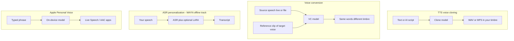
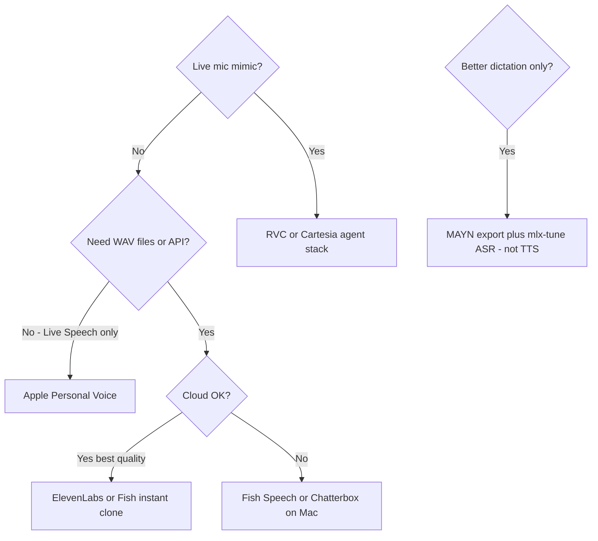

# Voice cloning & replication landscape (2026)

**Status:** Complete (research pass)  
**Date:** 2026-05-29  
**Related:** [voice-personalization-and-training.md](voice-personalization-and-training.md), [voice-training-pilot-o3b-2026-05-29.md](voice-training-pilot-o3b-2026-05-29.md), [voice-cloning-vendor-evaluation-2026.md](voice-cloning-vendor-evaluation-2026.md), [voice-cloning-integration-decision-2026.md](voice-cloning-integration-decision-2026.md)  
**Toolkit:** [`docs/voice-cloning/README.md`](../voice-cloning/README.md)

---

## 1. Executive summary

**Voice replication** (type text → audio that sounds like you) is a **different problem** from MAYN’s shipped **dictation personalization** (speech → better text via ASR + LLM cleanup). Your encrypted `voice_training_examples` WAVs can feed **both**, but ASR LoRA weights do **not** make TTS sound like you.

| Question | Answer (May 2026) |
|----------|-------------------|
| Can I type text and hear my voice? | **Yes** — commercial TTS cloning (ElevenLabs, Fish Audio, etc.) or open-weight models (Fish Speech, Chatterbox, XTTS). |
| Is it an “exact replica”? | **No** — marketing overstates; async messages can sound convincing; long-form, emotion, and breath are still weak. Blind-test before sending. |
| Can MAYN do this today? | **No** — export pipeline targets ASR training, not synthesis. |
| Fastest path with existing recordings? | Curate **1–5 min** clean speech → **ElevenLabs Instant** or **Fish Audio** → same [test script](../voice-cloning/test-script-en.txt). |
| Best privacy path? | **Fish Speech** or **Chatterbox** on Apple Silicon; **Apple Personal Voice** for Live Speech only (no WAV export). |

---

## 2. Technology taxonomy



| Family | Input → output | Primary use | Sample audio |
|--------|----------------|-------------|--------------|
| **TTS cloning** | Text → your-voice audio | Voice notes, narrations, AI scripts read aloud | 1–5 min instant; 30+ min pro |
| **Voice conversion (VC)** | Speech → speech (your timbre) | Live calls, streaming, “sound like me while talking” | Seconds to 10+ min train (RVC) |
| **Speech-to-speech** | Audio → audio (style/voice) | Dubbing, delivery change | Short reference |
| **ASR personalization** | Speech → text | Dictation accuracy | Hours paired audio+text |
| **Apple Personal Voice** | Text → on-device speech | Accessibility, Live Speech | ~150 prompted phrases |

**Do not conflate:** Whisper/Qwen LoRA from [`docs/voice-training/README.md`](../voice-training/README.md) improves **transcription**, not **synthesis**.

---

## 3. Cloud / SaaS vendors

Sources: vendor docs, API comparison blogs, May 2026. Re-verify pricing and limits before production use.

### Tier A — cloning + API

| Vendor | Clone setup (public) | Strengths | Caveats |
|--------|----------------------|-----------|---------|
| [ElevenLabs](https://elevenlabs.io/voice-cloning) | **Instant:** ~1–5 min clean audio; **Professional:** 30+ min (Creator+) | Quality benchmark, emotion, 32+ langs, API/WebSocket | Cloud; IVC is not full fine-tune; paid at scale |
| [Resemble AI](https://www.resemble.ai/) | Rapid clone (~20 s marketing); enterprise controls | SOC 2, watermarking, on-prem; [Chatterbox](https://github.com/resemble-ai/chatterbox) OSS (MIT) | Enterprise pricing |
| [Fish Audio](https://fish.audio/) | ~10–15 s instant (reviews) | Cost at scale; [Fish Speech](https://github.com/fishaudio/fish-speech) Apache-2.0 | Cloud ≠ self-host |
| [Cartesia](https://cartesia.ai/) | ~3 s zero-shot (benchmarks) | Sub-100 ms class latency for agents | Studio quality may trail ElevenLabs |
| [PlayHT](https://play.ht/) | Custom voices + streaming | Telephony/product embedding | Compare on your accent |
| [Inworld](https://inworld.ai/) | Zero-shot 5–15 s; pro on request | Free zero-shot tier (2026 reports); agent focus | Not dictation |
| [Azure Custom Neural Voice](https://learn.microsoft.com/azure/ai-services/speech-service/professional-voice-create-project) | Enterprise project | Compliance, SSML | Heavy setup |
| [Google Cloud Custom Voice](https://cloud.google.com/text-to-speech/docs/custom-voice) | Enterprise | Language scale | Same friction |

**ElevenLabs Instant Voice Cloning (IVC)** — per [docs](https://elevenlabs.io/docs/overview/capabilities/voices): does not train a dedicated model; uses prior knowledge + your samples. Sweet spot **~1–2 minutes** clean audio; beyond **~3 minutes** can hurt stability. **Professional Voice Cloning (PVC)** needs **30+ minutes** (3 hours optimal).

### Tier B — creator editor workflow

| Vendor | Fit |
|--------|-----|
| [Descript Overdub](https://www.descript.com/overdub-2) | Fix recordings by editing transcript; ~60–90 s + Voice ID consent |
| Murf / WellSaid | Business e-learning; cloning secondary |

### Tier C — real-time / VC

| Tool | Fit |
|------|-----|
| [RVC WebUI](https://github.com/RVC-Project/Retrieval-based-Voice-Conversion-WebUI) | Real-time VC; **≥10 min** clean training recommended |
| [MeanVC](https://github.com/ASLP-lab/MeanVC) | Research streaming zero-shot VC |
| Cartesia / Hume | Low-latency agent stacks |

---

## 4. Open source on Mac (Apple Silicon)

| Project | License | Clone input | Notes |
|---------|---------|-------------|-------|
| [Fish Speech](https://github.com/fishaudio/fish-speech) | Apache-2.0 | Short reference | Strong 2026 open-weight; self-host |
| [Chatterbox](https://github.com/resemble-ai/chatterbox) | MIT | ~5–10 s claimed | Some blind tests vs ElevenLabs; verify on your voice |
| [XTTS v2](https://huggingface.co/coqui/XTTS-v2) | **CPML (non-commercial)** | ~6 s zero-shot | Coqui shut down 2024; community maintained |
| [OpenVoice v2](https://github.com/myshell-ai/OpenVoice) | MIT | Short ref | Fast experiments, style control |
| [Kokoro](https://github.com/hexgrad/kokoro) | Apache-2.0 | Stock voices | Lightweight; weak for “my voice” |
| RVC / MeanVC / Conan | OSS | VC not arbitrary TTS | Live mimic, not “type any text” |

**Hardware:** M4 Max class Mac can run Fish Speech / Chatterbox; expect Python venv, model downloads, and manual QA.

---

## 5. Apple Personal Voice

[Personal Voice](https://support.apple.com/guide/mac-help/create-a-personal-voice-mchldfd72333/mac) (Apple silicon):

- Trains **on-device** from prompted phrases; use with **Live Speech** and allowed AAC apps.
- **Personal, non-commercial**; AAC apps may speak with permission but **cannot capture/export** synthesized audio (per Apple Support).
- **Not** a replacement for ElevenLabs-style export, batch TTS, or Slack voice-note automation.

Worth enabling for **system typed speech** that sounds like you in FaceTime/Live Speech.

---

## 6. Legal & consent (personal use)

| Regime | Relevance |
|--------|-----------|
| [Tennessee ELVIS Act](https://www.capitol.tn.gov/BillInfo/BillSummaryArchive.aspx?billNumber=HB2097&ga=113) (2024) | Voice as protected likeness against unauthorized AI mimic |
| [NO FAKES Act](https://www.congress.gov/bill/119th-congress/senate-bill/1367) (pending, 2025–2026) | Federal voice/likeness replica rights |
| EU AI Act Art. 50 | Synthetic audio disclosure (strengthening 2026) |
| Vendor policies | Descript/ElevenLabs/Resemble require consent / Voice ID |

**For your own voice:** lower risk, but still avoid deceptive outbound messages; label synthetic audio when publishing.

---

## 7. MAYN corpus mapping

Current production stats (2026-05-29): **39** training rows, **~4.1 min** total, **0** `high` quality — see [pilot report](voice-training-pilot-o3b-2026-05-29.md).

| Goal | Reuse MAYN export? | Path |
|------|-------------------|------|
| Type → my voice | **Yes** — curate clean WAVs | Cloud instant clone or OSS; see [reference pack](../voice-cloning/reference-pack/) |
| Live sound like me | Partial | RVC, MeanVC, Cartesia |
| Podcast/video fixes | **Yes** | Descript Overdub |
| Dictation accuracy | **Yes** (primary) | Post-edit → `high` → `make voice-training-pilot` |
| Send voice note from typed text | Integration needed | API + Shortcuts or helper app; no dictation app does E2E |

### Audio hygiene for cloning

- Single speaker, minimal reverb/keyboard/room tone.
- **1–5 min** curated for instant clone; **30+ min** for pro tier.
- Separate **studio read** clips from messy desk dictation used for ASR.

### Curation tooling

```bash
# After: Cmd+Q app, make voice-training-export voice-training-extract
./scripts/voice-cloning/curate-reference-pack.sh
```

Outputs under `docs/voice-cloning/reference-pack/` (manifest + `instant/` WAV list).

---

## 8. Evaluation protocol

1. Use fixed script: [`docs/voice-cloning/test-script-en.txt`](../voice-cloning/test-script-en.txt).
2. Reference audio: `instant/` pack (~2 min target; may be shorter until corpus grows).
3. Run matrix (same script): ElevenLabs Instant, Fish Audio, one local OSS, optional Descript, subjective Apple Live Speech.
4. Score blind: naturalness, prosody, mispronunciations, “would I send this as me?”
5. Record in [voice-cloning-vendor-evaluation-2026.md](voice-cloning-vendor-evaluation-2026.md).

---

## 9. Decision tree



---

## 10. MAYN product boundary

Per [voice-personalization-and-training.md](voice-personalization-and-training.md): competitors optimize **prompt-level** cleanup, not in-app voice synthesis. Integration options are scoped in [voice-cloning-integration-decision-2026.md](voice-cloning-integration-decision-2026.md).

---

## 11. Annotated links

| ID | Resource |
|----|----------|
| L1 | [ElevenLabs voice cloning](https://elevenlabs.io/voice-cloning) |
| L2 | [ElevenLabs IVC docs](https://elevenlabs.io/docs/overview/capabilities/voices) |
| L3 | [Fish Speech GitHub](https://github.com/fishaudio/fish-speech) |
| L4 | [Chatterbox GitHub](https://github.com/resemble-ai/chatterbox) |
| L5 | [Descript Overdub](https://www.descript.com/overdub-2) |
| L6 | [Apple Personal Voice](https://support.apple.com/guide/mac-help/create-a-personal-voice-mchldfd72333/mac) |
| L7 | [MAYN voice training README](../voice-training/README.md) |
