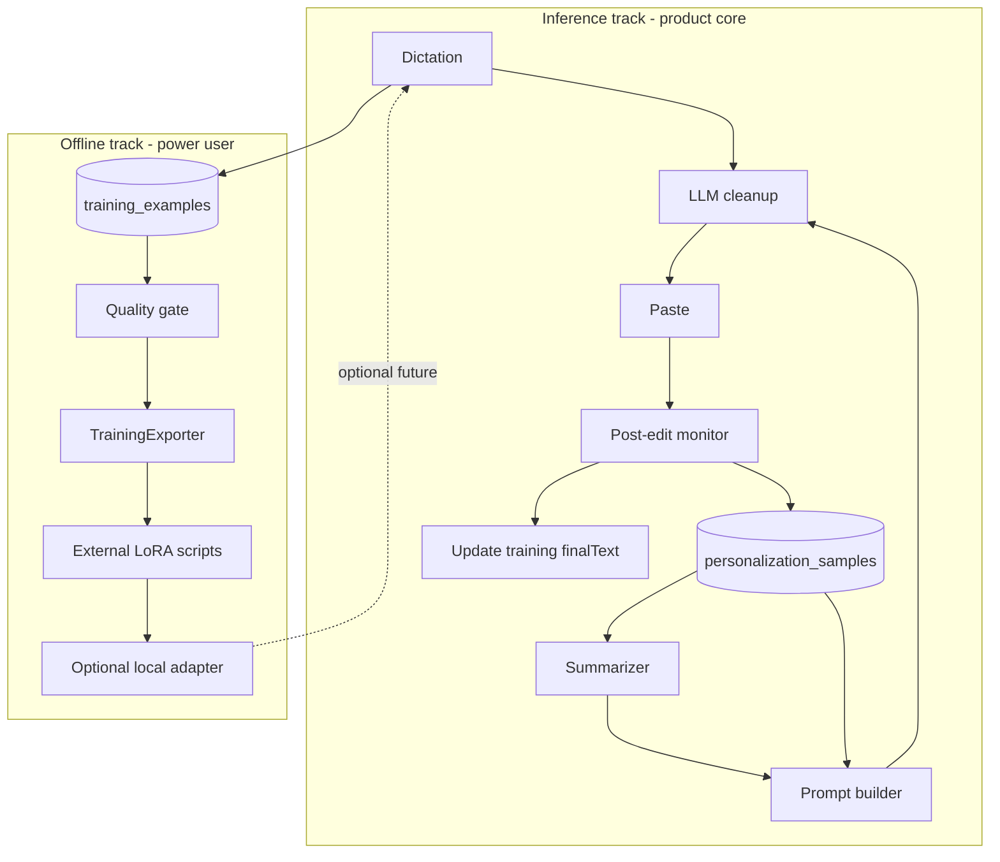

# Voice Personalization & Offline Training — Research Findings

**Status:** Complete (research pass)  
**Date:** 2026-05-29  
**Normative follow-up:** [`docs/specs/voice-personalization-and-training-v1.md`](../specs/voice-personalization-and-training-v1.md)

---

## 1. Executive summary

MAYN’s two-track model matches how the dictation market actually works:

| Track | Industry norm | MAYN today |
|-------|-----------------|------------|
| **Inference-time personalization** | Manual modes, dictionaries, few-shot examples, optional screen context; rare automatic “learn from edits” | **Shipped:** post-edit AX capture → encrypted samples → LLM summary → inject into cleanup prompt |
| **Offline training** | Usually **absent** in consumer apps; power-user or vendor-side pipelines; JSONL + audio for Whisper LoRA | **Partial:** `voice_training_examples` + encrypted WAV; **not built:** export, fine-tune UI, training examples browser |

**Validated hypothesis:** Competitors optimize **prompt-level** adaptation (modes, dictionary, examples). **On-device weight training** is not a standard consumer feature. The credible offline path for MAYN is **export → external LoRA/fine-tune** (Plan 8f), aligned with projects like [Listenr](https://github.com/Rebreda/listenr).

**Research-backed recommendation:** Keep investing in inference track (quality of examples, retrieval, per-app controls, Superwhisper-style mode examples in UI). Build offline track as **dataset hygiene + export + documented scripts**, not in-app training. Do **not** backfill Typeless history into personalization samples without real `before → after` pairs.

---

## 2. Competitor matrix

Sources: public docs, marketing, help centers (May 2026). No proprietary reverse-engineering.

| Product | Inference mechanism | Learn from edits? | Per-app config | Training / export | Local-only option | Privacy (public claims) | Gaps vs MAYN |
|---------|---------------------|-------------------|----------------|-------------------|-------------------|-------------------------|--------------|
| **Superwhisper** | Per-**mode** AI instructions; optional input/output **examples** in mode JSON; context toggles (app, clipboard, selection); built-in mode presets (Email, Note, etc.) | No automatic loop; user configures examples | **Auto-activation rules** per app/website | None advertised | Yes (local STT modes) | Local processing available; cloud AI optional per mode | MAYN has automatic post-edit learning; Superwhisper has richer **manual** example UI in modes |
| **VoiceInk** | **Power Mode** (app/URL profiles); **Enhancement modes** (LLM prompt templates); Personal Dictionary + replacements; screen context | No AX edit loop in public docs | Per-app Power Mode + hotkey override (#228) | None; GPL source | Yes (whisper.cpp, FluidAudio) | 100% offline claimed | MAYN: summarizer + encrypted edit store; VoiceInk: stronger **mode switching UX** to study |
| **Typeless** | Cloud STT + LLM cleanup; “personalized style and tone”; per-app tone; custom vocabulary | Claims style adapts over time (opaque; likely cloud prompt/profile) | Per-app tone | None; on-device **history** only | No (cloud processing) | Zero retention; not trained on user data; history local | MAYN is local-first; Typeless import fills transcripts only |
| **Wispr Flow** | AI auto-edits; **personal dictionary** (vocab + post-transcription replacements); style presets by app category | **Auto-add dictionary** from corrections (proper nouns via AI, not full style model) | Style rules per category (work/personal/email) | CSV bulk import (paid); no model export | Partial (mobile/desktop sync; cloud STT) | Cloud processing; dictionary words sent to server for recognition | MAYN dictionary is local; Wispr has **auto-vocab from corrections** (v2 candidate) |
| **Aqua Voice** | Custom dictionary; **custom instructions**; screen context; phonetic pipeline (marketing) | Roadmap: “tailor inference stack” including weights (aspirational) | Tone/rules; Team settings | None | Starter limited; Pro cloud | Cloud + local engine tiers | MAYN already does LLM cleanup; Aqua stresses **ASR-side** dictionary boosting |
| **OpenWhispr** | Multi-engine STT; cloud/local LLM registry; notes/meetings | Not emphasized | App-level usage | None (MIT) | Yes | Open source; optional cloud | Provider registry pattern — **adopt pattern** (MIT) |
| **Voibe / Speakmac** | Offline Whisper-class | Varies | Limited | None | Yes | Strong offline story | Privacy positioning reference for MAYN |
| **Dragon / Nuance** | User vocabulary, acoustic adaptation (legacy) | N/A (rules) | Per-app vocab | Enterprise custom language models | Partial | Enterprise | Historical baseline: **vocab + acoustic**, not LLM few-shot |

### Tier B (adjacent, not deep-dived)

- **MacWhisper** — transcription-first; weak dictation personalization.
- **Grammarly / Notion AI** — cloud rewrite; enterprise “memory” patterns differ from dictation.

### Competitor takeaways for MAYN

1. **Few-shot examples in cleanup prompts** are industry-standard (Superwhisper Custom mode docs explicitly document input/output example pairs).
2. **Dictionary + replacements** are the universal ASR-side lever; post-transcription replacements (Wispr) parallel MAYN’s dictionary at cleanup time.
3. **Automatic edit learning** is a **differentiator** for MAYN vs most competitors — but it must stay privacy-bounded (AX allowlist, no password fields).
4. **Export/fine-tune** is a **power-user** story (Listenr), not a Wispr/Typeless consumer feature.

---

## 3. Annotated bibliography

Each entry: claim → method → data needed → MAYN applicability → risk.

### Inference / cleanup personalization

| ID | Reference | Claim / method | Data needed | MAYN track | Risk / note |
|----|-----------|----------------|-------------|------------|-------------|
| P1 | Brown et al., GPT-3 (2020); few-shot prompting surveys | In-context examples steer format/style without weight updates | 2–5 curated (input, output) pairs | **Inference** | Quality of examples > quantity; recency bias |
| P2 | Katinskaia et al., ACL Findings 2024 ([PDF](https://aclanthology.org/2024.findings-acl.711.pdf)) | LLM GEC: few-shot helps but model- and prompt-dependent; minimal-edit vs fluency-edit benchmarks differ | Labeled GEC sets | **Inference** | Dictation cleanup should target **minimal-edit** (MAYN prompt already does) |
| P3 | Sorokin et al., BEA 2025 ([PDF](https://aclanthology.org/2025.bea-1.38.pdf)) | **Retrieval-based** few-shot example selection beats random for GEC | Error-type similarity | **Inference** | Future: retrieve samples by edit type, not only “most recent” |
| P4 | Edit-level majority voting, arXiv 2025/2026 | Training-free reduction of LLM over-correction via multi-sample voting | Multiple LLM samples | **Inference** (optional) | Extra latency/cost; MAYN already minimizes edits in prompt |
| P5 | Liang et al., minimal-edit GEC fine-tuning, 2025 | Fine-tuning LLMs for minimal-edit GEC possible but heavy | Thousands of labeled edits | **Neither v1** | Confirms prompt-first; fine-tune cleanup model is Plan 7+ territory |
| P6 | OWASP / industry prompt injection guidance | User content in system prompts needs delimiters + “data not instructions” | N/A | **Inference** | MAYN: `<EXAMPLES>` + anti-injection line in `VoicePromptBuilder` — **aligned** |

### Offline ASR / continuous improvement

| ID | Reference | Claim / method | Data needed | MAYN track | Risk / note |
|----|-----------|----------------|-------------|------------|-------------|
| P7 | Radford et al., Whisper (2022) | General ASR; domain adaptation via fine-tune | Audio + transcript, 16 kHz, segment limits | **Offline** | Base reference |
| P8 | Hu et al., LoRA (2021); HF PEFT Whisper examples | LoRA adapts Whisper with ~1% trainable params | Hours of paired audio-text | **Offline** | Consumer Mac may need external GPU or batch job |
| P9 | Diabolocom Whisper LoRA tutorial (2024) | Practical recipe: 1–30 s clips, LoRA on encoder/decoder projections | Domain conversational speech | **Offline** | Matches `TrainingExporter` segment guidance |
| P10 | S2-LoRA on Whisper for child speech, arXiv 2023 | PEFT for low-resource speaker/domain adaptation | Domain audio | **Offline** | Theoretical backing for personal ASR adapter |
| P11 | Neural Base, continuous improvement pipeline (blog) | Log predictions + user corrections → JSONL → periodic fine-tune | `audio_id`, `corrected_text` | **Offline** | Maps 1:1 to `voice_training_examples.finalText` |
| P12 | Listenr README (2026) | End-to-end: record → LLM correct → manifest.jsonl → LoRA → merge | Personal manifest + wav | **Offline** | **Closest OSS reference implementation** for MAYN Plan 8f |

### Skipped for v1 (documented)

- RLHF/DPO on cleanup models (cost, safety, no local weights).
- Federated cross-user learning (conflicts with local-first).

---

## 4. Open-source map & borrow list

### Audit summary

| Project | License | Data model | LLM timing | User edits | Export / train | Verdict |
|---------|---------|------------|------------|------------|----------------|---------|
| [Beingpax/VoiceInk](https://github.com/Beingpax/VoiceInk) | **GPL-3.0** | History, modes, dictionary | Sync enhancement optional | Manual dictionary | None | **Study only** — no code copy into MAYN |
| [OpenWhispr/openwhispr](https://github.com/OpenWhispr/openwhispr) | **MIT** | SQLite notes, multi-engine | Cloud/local providers | N/A | None | **Adopt patterns** — provider registry, engine selection |
| [Rebreda/listenr](https://github.com/Rebreda/listenr) | **MPL-2.0** | `manifest.jsonl` + per-utterance wav | Optional local LLM correct before save | LLM cleanup of transcript | HF splits + LoRA + merge | **Adopt patterns** — export schema & pipeline docs; scripts may live outside app |
| [farisalasmary/finetune-openai-whisper](https://github.com/farisalasmary/finetune-openai-whisper) | **MIT** | JSONL: `utt`, `audio_filepath`, `text`, `duration` | N/A | Ground-truth `text` | Training CLI | **Adopt patterns** — JSONL field names, duration filters |
| [huggingface/peft](https://github.com/huggingface/peft) | Apache-2.0 | N/A | N/A | N/A | Whisper LoRA examples | **Reference** for export compatibility |
| [FluidAudio](https://github.com/FluidInference/FluidAudio) / [WhisperKit](https://github.com/argmaxinc/WhisperKit) | Permissive | Inference | N/A | N/A | No training | Already in MAYN stack |

### Borrow list (actionable)

| Pattern | Source | MAYN action |
|---------|--------|-------------|
| Per-app profile + enhancement prompt | VoiceInk, Superwhisper | Already have `VoicePersonalizationContext`; consider **mode example pairs** in UI (like Superwhisper) |
| Provider / engine registry | OpenWhispr | Already have cleanup/ASR factories; document parity |
| `manifest.jsonl` + train/dev/test + LoRA | Listenr | Implement **TrainingExporter** + `scripts/finetune-whisper/` (out of app) |
| JSONL utterance schema + 1–30 s filter | finetune-openai-whisper, Diabolocom | Encode in exporter validation |
| Correction logging loop | Neural Base blog | Already: `updateFinalText` after post-edit monitor |
| GPL Swift UI patterns | VoiceInk | **Do not copy** — reimplement |

---

## 5. MAYN gap analysis

### Shipped (inference track)

- `VoicePostEditLearningMonitor` + `VoicePersonalizationPrivacyFilter`
- `voice_personalization_samples` + `VoicePersonalizationSummarizer`
- `VoicePromptBuilder` injection (`STYLE_NOTES`, `STYLE_SUMMARY`, `EXAMPLES`)
- `VoicePersonalizationPage` (learn toggle, training examples toggle, app controls, clear/reset)
- Per-app disable = hard opt-out of all personalization fields

### Partial (offline / data track)

- `voice_training_examples` with quality ladder (`medium` → `high` when post-edit verified)
- Encrypted WAV via `VoiceTrainingExampleStore.saveEncryptedAudio`
- Typeless import → transcripts + optional training rows (`typeless_import`); **no** personalization samples
- History retention, retry, download (audio-dependent)

### Not built

- `TrainingExporter` (Plan 8f)
- Training examples list UI (`VoiceTrainingExamplesSection` placeholder)
- Auto-learned dictionary from history diffs (design doc v2)
- In-app fine-tune or model picker for personal Whisper
- Retrieval-based example selection (paper P3)

### vs industry

| Capability | Leaders | MAYN |
|------------|---------|------|
| Manual mode examples | Superwhisper | Style notes + auto examples only |
| Dictionary auto-learn from corrections | Wispr | Manual dictionary only |
| Per-app auto profile | VoiceInk, Superwhisper | Shipped (contexts) |
| Post-edit AX learning | Rare | **Shipped** |
| Export for fine-tune | Listenr (niche) | Planned |

---

## 6. Recommended architecture (dual track)

**Principles**

1. **Inference track** improves the **next** cleanup via prompts only — no weight updates in-app.
2. **Offline track** optimizes **ASR** (and optionally documents cleanup fine-tune as research-only).
3. **Single audio file** per utterance when either `saveTrainingExamples` or `saveAudio` is on; orphan sweep respects both tables.
4. **Cloud summarization** for personalization must remain opt-in/disclosed (spec-1 B4).

---

## 7. Phased roadmap (research-backed)

| Phase | Inference track | Offline track |
|-------|-----------------|---------------|
| **Now (shipped)** | Post-edit learning, summarizer, prompt injection | Training row + WAV capture, Typeless import |
| **Next** | Superwhisper-style **example editor** in Personalization; optional retrieval for examples (P3) | **TrainingExporter** + quality filter export; training examples list UI |
| **Later** | Wispr-like **auto-dictionary** from high-confidence proper nouns (v2) | Documented `scripts/finetune-whisper-lora.sh`; optional MLX path for Apple Silicon |
| **Defer** | Multi-sample voting (P4) | In-app training UI; cleanup model fine-tune (P5) |

Implementation plans: Plan **8f** (export), new spec tasks, optional follow-up plan for dictionary auto-learn.

---

## 8. Open questions & risks

| Risk | Mitigation |
|------|------------|
| AX post-edit capture in password managers | Deny list in `VoicePersonalizationPrivacyFilter`; fail-closed |
| Prompt injection via learned examples | Delimiters + anti-injection line; summarizer strips `<>` |
| Cloud LLM summarization sends edit pairs | User disclosure; prefer local provider when available |
| GPL contamination from VoiceInk | Patterns only, no source copy |
| Typeless synthetic personalization | **Do not** import `refined_text` alone as `before/after` |
| Over-correction in cleanup | Minimal-edit prompt; monitor may vote later (P4) |
| Fine-tune data volume | Publish minimums in spec (e.g. 30+ min speech, 50+ verified edits for LoRA pilot) |

---

## 9. Review workshop (mingjie-father)

Decisions requested after reading this doc and [`voice-personalization-and-training-v1.md`](../specs/voice-personalization-and-training-v1.md).

### 9.1 Privacy bar (recommended: approve as-is)

- Keep AX allowlist + secure-field rejection + 2 KB caps.
- Keep “no upload” default; any cloud cleanup/summarization = user-configured provider only.
- Training export = explicit user action to Advanced / Personalization.

### 9.2 Post-research implementation priority

Research supports **parallel tracks**, sequenced:

1. **Inference (higher user-visible ROI):** Example editor UI; clarify Personalization empty state; optional example retrieval.
2. **Offline (enables power users):** TrainingExporter + export quality gates; finetune script in repo (Listenr-aligned).

**Recommended default if choosing one first:** Inference UI polish (examples + onboarding copy), then exporter.

### 9.3 Typeless backfill policy (recommended)

| Data | Backfill? |
|------|-----------|
| `voice_transcripts` | Yes (done) |
| `voice_training_examples` with `cleaned_text = final_text = refined`, `quality = low/import` | Yes, Swift CLI with audio |
| `voice_personalization_samples` | **No** unless Typeless stores pre/post edit pairs |

---

## 10. References (external)

- Superwhisper Custom Mode: https://superwhisper.com/docs/modes/custom  
- Wispr Flow dictionary: https://docs.wisprflow.ai/articles/4052411709-teach-flow-your-words-with-the-dictionary  
- Typeless product: https://www.typeless.com/  
- Aqua Voice dictionary: https://aquavoice.com/guide/dictionary  
- VoiceInk: https://github.com/Beingpax/VoiceInk  
- OpenWhispr: https://github.com/OpenWhispr/openwhispr  
- Listenr: https://github.com/Rebreda/listenr  
- MAYN spec-1: [`docs/spec-1-personalization-plan-v2.md`](../spec-1-personalization-plan-v2.md)  
- MAYN voice design: [`docs/superpowers/specs/2026-05-11-voice-dictation-design.md`](../superpowers/specs/2026-05-11-voice-dictation-design.md)
