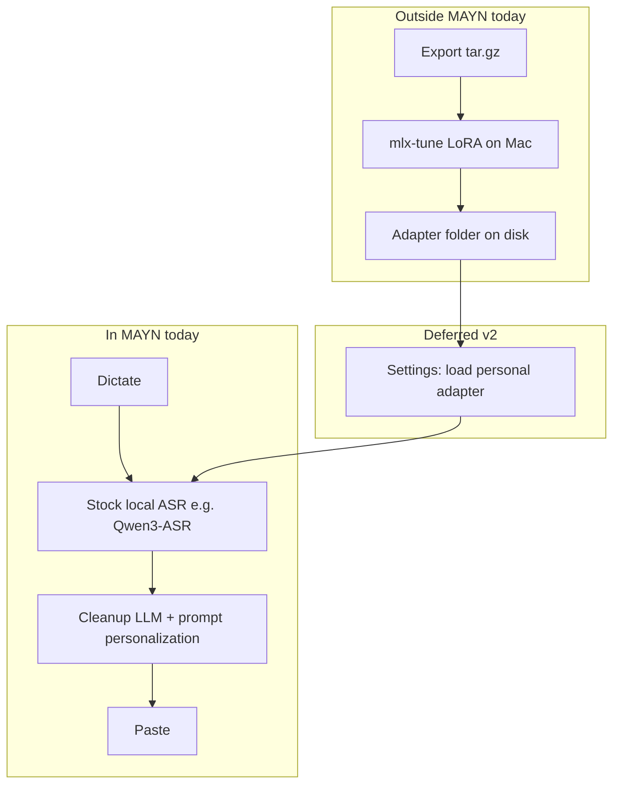

# Voice Personalization — Backlog & v2 Spec

**Status:** Living backlog (research folder)  
**Normative product spec:** [`docs/specs/voice-personalization-and-training-v1.md`](../specs/voice-personalization-and-training-v1.md)  
**Adoption verification:** [`docs/voice-personalization-adoption-verification.md`](../voice-personalization-adoption-verification.md)  
**Parent research:** [`voice-personalization-and-training.md`](voice-personalization-and-training.md)

This document explains **what is in the app today**, what is **deferred**, and the planned **v2: in-app personal ASR adapter loading**. It exists so “adapter loading” and “deferred” are not only described in chat or the adoption plan.

---

## 1. Two tracks (do not conflate)

| Track | Improves | Runs where | v1 status |
|-------|----------|------------|-----------|
| **Inference personalization** | **Cleanup** text (punctuation, tone, your edit patterns) | Inside MAYN on every dictation | **Shipped** |
| **Offline ASR adaptation** | **Raw transcription** (names, jargon, your voice) | Export → external mlx-tune → adapter files on disk | **Export shipped**; **adapter use in-app deferred** |

Training a LoRA on Qwen3-ASR **does not** change cleanup behavior until you either:

- load that adapter during **ASR** in-app (v2), or  
- run ASR inference yourself outside MAYN.

Cleanup personalization (post-edit learning, pinned examples, style notes) is independent and already active.

---

## 2. Shipped in v1 adoption (not deferred)

Use this as the “what works now” checklist.

| ID | Capability | Where in app |
|----|------------|----------------|
| — | Post-edit learning → encrypted samples → summarizer → prompt | Personalization; automatic after paste + edit |
| A1 | Pinned before/after cleanup examples | Personalization → **Cleanup examples** |
| A2 | AX / encryption / export copy | Personalization, onboarding AI cleanup |
| A5 | Per-app enhancement presets (Email / Slack / Code) | Personalization → Manage apps → **Preset** |
| O1 | Training examples list + filter + delete | Voice Settings → **Training examples** |
| O2 | Export `data.jsonl` + `audio/*.wav` → `.tar.gz` | Personalization or Advanced → **Export…** |
| O3 | Mac MLX fine-tune guide + `prepare-dataset.py` | [`scripts/voice-finetune-mac/`](../../scripts/voice-finetune-mac/) |

**Dogfood (manual, not app code):** O3b — run mlx-tune on M4 Max, document phrase accuracy in a local `eval/O3b-report.md`.

---

## 3. Deferred (explicit backlog)

| ID | Item | Why deferred | Depends on |
|----|------|--------------|------------|
| **V2-1** | **In-app personal adapter loading** | Requires FluidAudio/MLX loader + settings + model-ID safety; export path must exist first | O2, O3b dogfood |
| A3 | Retrieval-based example selection for `<EXAMPLES>` | Quality at scale; prompt path works with newest-first | — |
| A4 | Auto-dictionary suggestions from single-token proper-noun edits | Wispr-like; needs confirm UX | Post-edit monitor |
| O5 | In-app LoRA training UI | Scope, thermals, support burden; Listenr-class stays external | — |
| — | Cleanup model fine-tune (RLHF / GEC weights) | Research P5; minimal-edit risk | — |
| — | Multi-sample voting in cleanup | Paper P4; no user complaints yet | — |
| — | Federated / cloud upload of training data | Privacy product line | — |

---

## 4. v2 spec — In-app personal adapter loading (V2-1)

**User story:** After I fine-tune Qwen3-ASR (or Parakeet) on my Mac, I want MAYN dictation to use **my adapter** without running a separate Python script.

### 4.1 Out of scope for v2

- Training inside the app (remains external: export + mlx-tune).
- Automatic download or cloud sync of adapters.
- Applying a Whisper LoRA when the active engine is Qwen3-ASR (engine and adapter family must match).
- Cleanup LLM weight updates (inference track stays prompt-only).

### 4.2 In scope (proposed)

| Requirement | Notes |
|-------------|--------|
| Settings field | Path or “Choose folder…” to adapter directory produced by mlx-tune |
| Engine guard | Only offered when local ASR is Qwen3-ASR (or Parakeet if/when exposed the same way) |
| Validation | On save: folder exists, expected adapter manifest/files present; clear error if incompatible |
| Runtime | `VoiceLocalASREngine` (or FluidAudio wrapper) loads base + LoRA when enabled |
| Fallback | If load fails → log + fall back to stock model; user-visible status in Models settings |
| Disable | Toggle “Use personal adapter” default **off** |
| Export unchanged | O2 export format unchanged; adapter is separate artifact |

### 4.3 Acceptance criteria

1. User selects adapter folder; dictation uses personal weights (verified by improved transcription on 3+ held-out phrases vs stock model).
2. Disabling toggle restores stock model without app restart (or with documented one-time reload).
3. Switching ASR engine to Groq/cloud disables or hides personal adapter UI.
4. No regression: stock model path unchanged when adapter path empty.

### 4.4 Engineering notes (for planning)

- Investigate FluidAudio / MLX API for loading merged or adapter weights (may need vendored API bump).
- Persist path in `VoiceASRSettings` or dedicated `VoicePersonalAdapterSettings` (UserDefaults + security-scoped bookmark if needed).
- Add tests: mock loader success/failure; settings validation.
- Update [`voice-personalization-and-training-v1.md`](../specs/voice-personalization-and-training-v1.md) §4.4 when v2 is scheduled.

### 4.5 Go / no-go gate (from O3b)

Proceed with V2-1 implementation only if dogfood shows:

- Clear phrase-level gain on held-out proper nouns / jargon, and  
- Adapter inference latency ≤ ~2× stock on M4 Max class hardware.

Otherwise keep export + external inference as the supported power-user path.

---

## 5. Todo list (research backlog)

Copy into issue tracker as needed. Checkboxes track research/planning status, not app runtime.

### Shipped (v1 adoption) — verify manually

- [x] O2 `VoiceTrainingExporter`
- [x] O1 training examples UI
- [x] A1 pinned examples
- [x] A2 / A5 copy and presets
- [x] O3 Mac MLX README + `prepare-dataset.py`
- [x] O3b dogfood (smoke): export → whisper-tiny 12-step LoRA — see [`voice-training-pilot-o3b-2026-05-29.md`](voice-training-pilot-o3b-2026-05-29.md)

### Deferred — product

- [ ] **V2-1** In-app personal adapter loading (§4)
- [ ] A3 Retrieval for capped examples
- [ ] A4 Auto-dictionary suggestions
- [ ] O5 In-app training UI (intentionally unlikely)

### Deferred — docs hygiene

- [ ] Refresh [`voice-personalization-and-training.md`](voice-personalization-and-training.md) §5 “Not built” table to match v1 adoption (link here instead of duplicating)
- [ ] Promote §4 of this doc into normative spec when V2-1 is approved for implementation

---

## 6. Glossary

| Term | Meaning |
|------|--------|
| **Adapter / LoRA** | Small fine-tuned weight patch applied on top of a base ASR model |
| **Deferred** | Agreed direction, not implemented in the app yet |
| **Inference track** | Prompt-based cleanup personalization (no weight training in-app) |
| **Offline track** | Audio + labels for external ASR fine-tune |
| **Stock model** | Default Qwen3-ASR (or chosen engine) without personal adapter |

---

## Changelog

| Date | Change |
|------|--------|
| 2026-05-29 | Initial backlog + v2 adapter spec (from adoption plan / user clarification) |
